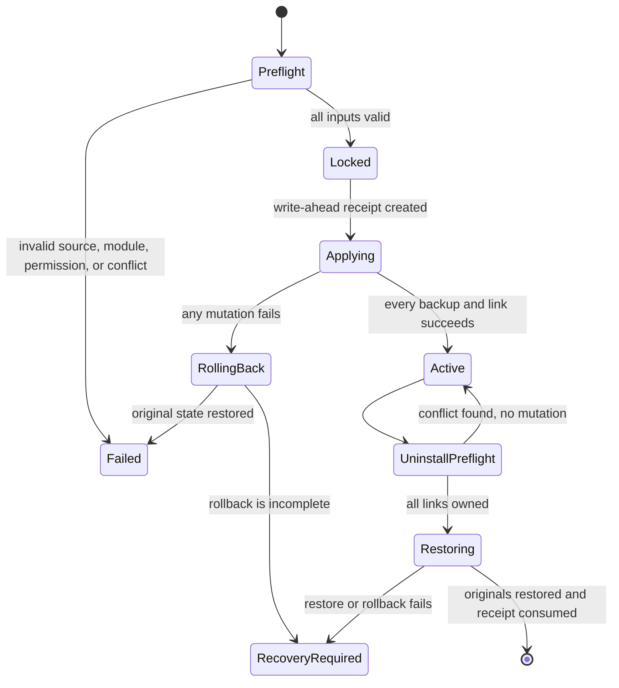

# Dotfiles 저장소 정리 및 가역 설치 시스템 PRD

- 상태: 구현 기준 초안
- 작성일: 2026-08-04
- 대상 저장소: `channprj/dotfiles-macOS`
- 대상 플랫폼: macOS
- 검토 상태: `review-me` 인터뷰가 사용자 요청으로 조기 종료됨. 확정되지 않은 항목은 아래의 안전 기본값과 명시적 보류로 기록함.

## 1. Executive Summary

### Problem Statement

현재 저장소에는 기본적인 심링크 설치·언인스톨 스크립트가 있지만, 설치 영수증이 없고 `latest` 백업 포인터 하나에 의존한다. 설치가 중단되거나 저장소가 이동하거나 설치 대상이 나중에 추가되면 원본 복구 기준이 불명확해질 수 있다. 저장소 자체도 기본 Vim 런타임에 사용하지 않는 178개 테마가 포함되고, 셸 초기화에는 중복 실행·하드코딩 경로·선택 도구의 무조건 실행이 남아 있다.

### Proposed Solution

기본 설정과 선택 모듈을 명확히 분리한 Bash 기반 심링크 설치기를 유지하되, 설치 영수증·사전 검사·실행 단위 롤백·충돌 차단을 추가한다. 공식 LazyVim Starter와 로컬 사용자 설정을 저장소에 편입하고, 레거시 자료는 삭제하지 않고 `archive/`로 분리한다. `hsa delete`에는 현재 디렉터리 기반 Herdr 세션의 확인형 중지·삭제 흐름을 추가한다.

### Success Criteria

1. 임시 `HOME`에서 기본 설치, 선택 모듈 설치, 반복 설치, 저장소 이동, 언인스톨 시나리오가 로컬과 GitHub Actions `macos-latest`에서 모두 통과한다.
2. 설치 중 어느 한 대상에서 실패를 주입했을 때 이번 실행 전에 존재하던 모든 대상의 종류, 내용, 심링크 대상이 그대로 복원된다.
3. 언인스톨 사전 검사에서 하나라도 사용자 변경과 충돌하면 어떤 대상도 변경되지 않고 충돌 목록이 출력된다.
4. 성공적인 언인스톨 후 활성 영수증과 소비된 백업은 제거되며, 기존의 무관한 `~/.dotfiles-backup/vim-*` 자료는 그대로 남는다.
5. `hsa delete`가 실행 중, 중지됨, 존재하지 않음, 중지 실패, 삭제 실패, 확인 거부, `--force` 상태를 결정론적으로 처리하고 회귀 테스트로 검증된다.

### Confirmed Decisions

| 영역 | 확정 내용 |
| --- | --- |
| 정리 강도 | 기존 개인 설정을 보존하는 보수적 전체 재정비 |
| 기본 설치 | Zsh, Direnv, Git, Vim, LazyVim |
| 선택 모듈 | `terminal`, `gnupg`, `brew` |
| 모듈 CLI | 반복 가능한 `--module <name>`과 `--all` |
| 패키지 책임 | 설정만 심링크하며 Homebrew 패키지는 자동 설치하지 않음 |
| 백업 루트 | `~/.dotfiles-backup`, `DOTFILES_BACKUP_DIR` 재정의 유지 |
| 복구 기준 | 설치 영수증과 활성 설치 기록 |
| 설치 실패 | 실행 단위 전체 자동 롤백 |
| 언인스톨 충돌 | 사전 검사 후 전체 중단 |
| 언인스톨 범위 | 활성 설치의 모든 기본·선택 항목을 한 번에 복구 |
| 보존 정책 | 성공 시 소비된 백업과 활성 영수증 제거, 실패 자료는 보존 |
| 저장소 이동 | 새 위치에서 재실행하면 소유 링크만 새 경로로 갱신 |
| 기존 링크 | 이 저장소를 가리키는 기존 심링크를 관리 대상으로 인수 |
| LazyVim | 최신 공식 Starter를 기준으로 로컬 `ambiwidth=single` 설정 병합 |
| LazyVim 잠금 | `lazy-lock.json` 추적 |
| Vim 레거시 | 기본 런타임과 `archive/` 보관 자료 분리 |
| 셸 정리 | 동작 보존형 이식성 정리 |
| 테마 | `terminal` 모듈이 `dpoggi-timestamp`를 설치하면 조건부 활성화 |
| 레거시 스크립트 | 작동하지 않거나 연결되지 않은 스크립트를 `archive/legacy-scripts/`로 이동 |
| 검증 | 로컬 테스트와 GitHub Actions `macos-latest` |
| Git | 의미 단위 Conventional Commit을 즉시 일반 push하고 매번 원격 `0 0` 확인 |

### Constraints

- macOS 기본 Bash 3.2에서 동작해야 한다. 연관 배열 등 Bash 4 이상 전용 기능을 사용하지 않는다.
- 설치기와 언인스톨러는 Homebrew, Neovim 플러그인, GUI 앱, 브라우저 설정, 키보드 펌웨어를 직접 설치·제거하지 않는다.
- 사용자가 이미 가진 ignored 파일과 로컬 자료(`.reviews/`, `.diff-summaries/`, `.zshalias-company`, `.netrwhist`)를 삭제하거나 커밋하지 않는다.
- 비밀 정보와 런타임 데이터가 섞인 `~/.codex`, `~/.claude` 전체 디렉터리는 메인 설치기가 심링크하지 않는다.
- 예산과 완료 기한은 지정되지 않았다.

### Deliberate Deferral

기본 편집기 정책은 인터뷰 종료 시점에 확정되지 않았다.

- 소유자: 저장소 사용자
- 결정 시점: 셸 정리 구현을 시작하기 전 또는 새 Mac에서 `mdner` 부재가 확인될 때
- 안전한 임시 기본값: 현재의 `EDITOR="mdner --wait"`, `VISUAL="mdner --wait"` 동작 유지
- 대기 결과: LazyVim은 `nvim` 명령으로 사용할 수 있지만 기본 편집기로 자동 선택되지 않는다.

## 2. User Experience & Functionality

### User Personas

- 저장소 소유자: 현재 Mac과 새 Mac에 개인 설정을 설치하고 원본으로 되돌릴 수 있어야 한다.
- 미래 유지보수자: 링크 목록, 모듈, 백업 상태, 실패 원인을 저장소 코드와 테스트만으로 이해할 수 있어야 한다.
- CI 운영자: 실제 사용자 홈을 건드리지 않고 임시 `HOME`에서 파일 관리 계약을 검증해야 한다.

### User Stories

#### US-1. 기본 설정 미리보기 및 설치

As a 저장소 소유자, I want to 기본 설치 변경을 미리 본 뒤 적용하고 싶다 so that 기존 설정 손실 없이 새 Mac을 구성할 수 있다.

Acceptance Criteria:

- `./install.sh --dry-run`은 파일, 디렉터리, 심링크를 생성·이동·삭제하지 않는다.
- `./install.sh`는 Zsh, Direnv, Git, Vim, LazyVim 대상만 선택한다.
- 선택된 모든 저장소 원본, 대상 경로, 백업 루트 쓰기 가능 여부를 변경 전에 검사한다.
- 기존 일반 파일·디렉터리·외부 심링크는 활성 설치 백업으로 이동한 뒤 저장소 심링크로 교체한다.
- 이미 이 저장소의 올바른 원본을 가리키는 심링크는 백업하지 않고 영수증에 `adopted` 상태로 기록한다.
- 알 수 없는 인자나 모듈이 있으면 어떤 변경도 하지 않고 종료 코드 `2`를 반환한다.

#### US-2. 선택 모듈 설치

As a 저장소 소유자, I want to 필요한 도구 설정만 명시적으로 추가하고 싶다 so that 설치 범위를 통제할 수 있다.

Acceptance Criteria:

- `./install.sh --module terminal --module gnupg`처럼 `--module`을 반복할 수 있다.
- `./install.sh --all`은 `terminal`, `gnupg`, `brew`를 한 번씩 선택한다.
- 같은 모듈을 반복 지정해도 각 대상은 한 번만 처리한다.
- `terminal`은 Ghostty 설정과 `dpoggi-timestamp` 테마를 관리한다.
- `gnupg`는 `gpg-agent.conf`만 관리한다.
- `brew`는 `~/Brewfile` 심링크만 관리하고 `brew bundle`을 실행하지 않는다.
- 나중에 추가된 모듈은 기존 활성 설치에 누적되고 전체 언인스톨 대상이 된다.

#### US-3. 설치 실패 자동 복구

As a 저장소 소유자, I want to 설치 중 오류가 나면 자동으로 시작 전 상태로 돌아가고 싶다 so that 셸 설정이 반쯤 설치된 상태로 남지 않는다.

Acceptance Criteria:

- 설치기는 활성 작업 잠금을 획득하지 못하면 변경 없이 실패한다.
- 모든 변경은 실행별 write-ahead 영수증에 대상과 의도를 먼저 기록한 뒤 수행한다.
- 하나의 백업 또는 링크 생성이 실패하면 이번 실행에서 생성한 링크를 제거하고 이동한 원본을 역순으로 복구한다.
- 롤백까지 성공하면 활성 설치에는 이번 실행의 항목이 추가되지 않는다.
- 롤백이 실패하면 복구 자료와 영수증을 삭제하지 않고 경로, 남은 상태, 수동 복구 지침을 출력한다.

#### US-4. 전체 언인스톨 및 원본 복구

As a 저장소 소유자, I want to 한 명령으로 설치된 모든 링크를 제거하고 원본을 복구하고 싶다 so that 설치 전 상태로 돌아갈 수 있다.

Acceptance Criteria:

- `./uninstall.sh --dry-run`은 활성 영수증의 전체 복구 계획과 충돌을 출력하지만 파일 시스템을 변경하지 않는다.
- 실제 언인스톨은 기본 항목과 나중에 추가된 모든 모듈을 포함한다.
- 모든 대상이 영수증에 기록된 소유 링크인지 먼저 검사한다.
- 일반 파일, 다른 심링크, 예상과 다른 저장소 링크가 하나라도 있으면 전체 작업을 변경 없이 중단한다.
- `adopted` 심링크는 제거하고 복구할 원본이 없는 것으로 처리한다.
- 원본 파일·디렉터리·심링크는 종류와 링크 문자열을 보존하여 원래 위치로 이동한다.
- 전체 복구 후 소비된 백업, 활성 영수증, 설치기가 만든 빈 부모 디렉터리를 제거한다.
- 설치기가 만들지 않은 백업 루트의 다른 항목은 제거하지 않는다.
- 활성 설치가 없을 때 재실행하면 안내 후 성공 종료한다.

#### US-5. 반복 설치와 저장소 이동

As a 저장소 소유자, I want to 설치기를 반복 실행하거나 저장소를 옮긴 뒤 다시 실행하고 싶다 so that 수동으로 링크를 복구하지 않아도 된다.

Acceptance Criteria:

- 같은 저장소 위치와 같은 대상 집합으로 재실행하면 파일 시스템과 백업이 바뀌지 않는다.
- 활성 영수증이 기록한 이전 저장소 링크는 새 위치에서 실행할 때만 새 저장소 원본으로 갱신한다.
- 위치 갱신은 원본 백업을 새로 만들지 않는다.
- 영수증이 소유하지 않은 외부 심링크는 저장소 이동으로 간주하지 않고 충돌로 처리한다.

#### US-6. LazyVim 구성 재현

As a Neovim 사용자, I want to 검증된 LazyVim 구성을 저장소에서 재현하고 싶다 so that 새 Mac에서도 같은 편집 환경을 사용할 수 있다.

Acceptance Criteria:

- `editor/nvim`은 구현 시점의 공식 [LazyVim Starter](https://github.com/LazyVim/starter)를 저장소 파일로 포함하며 중첩 `.git` 디렉터리를 포함하지 않는다.
- `lua/config/options.lua`에는 로컬 사용자 설정 `vim.opt.ambiwidth = "single"`이 유지된다.
- `lazy-lock.json`을 저장소에서 추적한다.
- `~/.config/nvim`의 기존 구성은 기본 설치 때 다른 대상과 동일한 영수증·백업·복구 계약을 따른다.
- 설치기는 Neovim이나 플러그인을 실행·다운로드하지 않고 누락된 필수 도구만 경고한다.
- 로컬 검증에서 플러그인 동기화가 성공하고 `:LazyHealth`에 오류가 없어야 한다. 선택 의존성 경고는 별도로 기록한다.

#### US-7. Herdr 세션 중지 및 삭제

As a Herdr 사용자, I want to 현재 프로젝트 세션을 `hsa delete`로 중지하고 삭제하고 싶다 so that 남은 세션을 별도 명령 두 개로 정리하지 않아도 된다.

Acceptance Criteria:

- 대상 세션 이름은 현재 디렉터리 basename이며 파일 시스템 루트에서는 `root`이다.
- `hsa delete`는 세션 목록을 먼저 조회하고 대상이 없으면 안내 후 성공 종료한다.
- 기본 실행은 `Stop and delete Herdr session '<name>'? [y/N]`을 표시한다.
- `y` 또는 `Y`만 진행으로 인정하고 다른 입력은 변경 없이 성공 종료한다.
- 비대화형 입력에서 확인이 필요한 경우 실패하고 `-f` 또는 `--force` 사용법을 안내한다.
- `hsa delete -f`와 `hsa delete --force`는 확인을 생략한다.
- 실행 중인 세션은 `herdr session stop <name>` 성공 후에만 `herdr session delete <name>`을 호출한다.
- 이미 중지된 세션은 stop을 생략하고 delete를 호출한다.
- stop 실패 시 delete를 호출하지 않고 비정상 종료한다.
- delete 실패는 숨기지 않고 비정상 종료한다.
- 지원하지 않는 인자는 사용법을 출력하고 종료 코드 `2`를 반환한다.
- 기존 인자 없는 `hsa` 연결·워크스페이스 조정 동작은 유지된다.

#### US-8. 저장소 구조 이해 및 유지보수

As a 미래 유지보수자, I want to 실행 설정, 선택 설정, 수동 자료, 레거시 자료를 구분하고 싶다 so that 무엇이 설치되는지 추측하지 않아도 된다.

Acceptance Criteria:

- README에는 기본 설치, 모듈, 백업 위치, 영수증, 충돌 복구, 언인스톨, 패키지 준비, 수동 자산을 구분해 설명한다.
- 기본 Vim 런타임에는 `vim-plug`, `onedark` 및 현재 `.vimrc`에 필요한 파일만 남는다.
- 나머지 Vim 테마, Pathogen, 테마 메뉴 플러그인은 `archive/vim/` 아래로 이동하고 기본 설치에서 제외한다.
- 작동하지 않는 `snippets/python/upgrade_pip.py`와 연결되지 않은 `git/hooks/pre-commit`은 `archive/legacy-scripts/`와 설명 문서로 이동한다.
- 브라우저, 키보드, BetterTouchTool, iTerm 키맵, 에이전트 스킬 설치 절차는 자동 심링크 대상과 분리해 문서화한다.
- ignored 로컬 파일은 삭제하거나 추적하지 않는다.

### Primary User Flows

#### 새 설치

```text
clone repository
  -> ./install.sh --dry-run
  -> review plan and warnings
  -> ./install.sh [--module ... | --all]
  -> preflight and lock
  -> backup originals and create links
  -> commit active receipt
  -> optional manual package setup
```

#### 원상 복구

```text
./uninstall.sh --dry-run
  -> inspect owned links and conflicts
  -> ./uninstall.sh
  -> lock and full preflight
  -> remove owned links and restore originals
  -> remove consumed backup and active receipt
```

#### Herdr 세션 삭제

```text
hsa delete [-f|--force]
  -> derive session from current directory
  -> find session and running state
  -> confirm unless forced
  -> stop when running
  -> delete stopped session
```

### Non-Goals

- Homebrew 패키지나 cask 자동 설치·제거
- LazyVim 플러그인 자동 설치를 `install.sh`의 파일 트랜잭션에 포함
- Linux 또는 Windows 지원
- Chrome, Safari, 키보드 펌웨어, BetterTouchTool, iTerm2 설정의 자동 가져오기
- `~/.codex`, `~/.claude` 런타임 디렉터리 전체 심링크
- 사용자 비밀 정보의 생성·이동·동기화
- 선택 모듈 단위 언인스톨
- 레거시 자료의 영구 삭제
- 기본 편집기를 LazyVim으로 변경
- 릴리스, 태그 또는 별도 브랜치 생성

## 3. AI System Requirements (If Applicable)

### Applicability

해당 없음. 설치기, 언인스톨러, 셸 함수, 테스트 및 문서는 결정론적인 로컬 파일 시스템과 CLI 동작만 사용한다. 런타임 AI 모델, 프롬프트, 외부 AI API, 평가 데이터셋은 필요하지 않다.

### Tool Requirements

- 구현과 검증에는 Git, Bash, Zsh, macOS 기본 파일 유틸리티가 필요하다.
- `hsa`는 현재와 동일하게 Herdr와 `jq`를 런타임 의존성으로 사용한다.
- LazyVim 실제 검증에는 공식 요구사항을 만족하는 Neovim과 Git이 필요하다. 구현 시점의 버전 기준은 [LazyVim Getting Started](https://www.lazyvim.org/)를 다시 확인한다.

### Evaluation Strategy

AI 품질 평가는 적용되지 않는다. 모든 요구사항은 파일 시스템 상태, 종료 코드, CLI 호출 기록, Git diff, CI 결과로 검증한다.

## 4. Technical Specifications

### Architecture Overview

#### Repository layout

```text
dotfiles/
├── install.sh
├── uninstall.sh
├── lib/
│   ├── links.sh              # 기본 및 모듈별 정적 매핑
│   └── transaction.sh        # 잠금, 영수증, 롤백 공통 로직
├── editor/
│   ├── .vimrc
│   ├── .vim/                 # 축소된 Vim 런타임
│   └── nvim/                 # LazyVim Starter + 사용자 설정 + lock
├── archive/
│   ├── vim/                  # 설치하지 않는 레거시 Vim 자료
│   └── legacy-scripts/       # 지원 종료 스크립트와 설명
├── sh/
├── git/
├── tests/
│   ├── install_test.bash
│   ├── hsa_test.zsh
│   ├── shell_startup_test.zsh
│   └── run.sh
├── docs/
│   └── prd/
└── .github/workflows/test.yml
```

파일명은 구현 과정에서 기존 패턴에 맞게 단순화할 수 있지만, 매핑과 트랜잭션 책임은 분리한다. 단일 사용처를 위한 불필요한 추상화는 만들지 않는다.

#### Install state flow



### Link Inventory

#### Default group

| Source | Destination |
| --- | --- |
| `sh/.zshrc` | `~/.zshrc` |
| `sh/.zshenv` | `~/.zshenv` |
| `sh/.zshalias` | `~/.zshalias` |
| `sh/.zshfunc` | `~/.zshfunc` |
| `sh/.zshexec` | `~/.zshexec` |
| `sh/.zsh-welcome` | `~/.zsh-welcome` |
| `sh/.direnvrc` | `~/.direnvrc` |
| `git/.gitconfig` | `~/.gitconfig` |
| `git/.gitignore_global` | `~/.gitignore_global` |
| `git/.tigrc` | `~/.tigrc` |
| `editor/.vimrc` | `~/.vimrc` |
| `editor/.vim` | `~/.vim` |
| `editor/nvim` | `~/.config/nvim` |

#### Optional groups

| Module | Source | Destination |
| --- | --- | --- |
| `terminal` | `editor/ghostty` | `~/.config/ghostty/config` |
| `terminal` | `sh/zsh/custom-zsh-theme/dpoggi-timestamp.zsh-theme` | `~/.oh-my-zsh/custom/themes/dpoggi-timestamp.zsh-theme` |
| `gnupg` | `sh/gnupg/gpg-agent.conf` | `~/.gnupg/gpg-agent.conf` |
| `brew` | `sh/Brewfile` | `~/Brewfile` |

### CLI Contract

```text
./install.sh [-n|--dry-run] [--module <terminal|gnupg|brew>]... [--all]
./install.sh [-h|--help]

./uninstall.sh [-n|--dry-run]
./uninstall.sh [-h|--help]
```

- `--all`과 개별 `--module`을 함께 사용해도 합집합을 한 번씩 처리한다.
- 위치 인자는 받지 않는다.
- dry-run과 실제 실행은 같은 사전 검사 및 계획 코드를 공유한다.
- 로그는 `info`, `ok`, `warn`, `error`, `skip` 수준을 사람이 읽을 수 있게 출력한다.
- 색상은 TTY일 때만 사용하거나 `NO_COLOR`를 존중한다.
- 오류 메시지에는 대상 경로, 실패한 작업, 안전한 다음 행동을 포함한다.

### Backup and Receipt Layout

기본 레이아웃은 다음과 같다.

```text
~/.dotfiles-backup/
├── active -> installations/<installation-id>
├── lock/
│   ├── pid
│   └── command
└── installations/<installation-id>/
    ├── manifest.tsv
    ├── repository-path
    ├── originals/<HOME-relative-path>
    └── runs/<run-id>.tsv
```

- 백업 루트와 설치 디렉터리는 권한 `0700`, 영수증 파일은 `0600`을 사용한다.
- 매핑 대상은 저장소의 정적 목록이므로 탭과 줄바꿈을 허용하지 않는다.
- 영수증은 셸 코드로 `source`하지 않고 데이터로 파싱한다.
- manifest에는 모듈, 저장소 상대 원본, HOME 상대 대상, 원본 종류, 백업 경로, 설치 링크 대상, 상태를 기록한다.
- 원본 종류는 최소 `absent`, `file`, `directory`, `symlink`, `adopted`를 구분한다.
- 실행 ID는 초 단위 타임스탬프만 사용하지 않고 PID 또는 충돌 없는 suffix를 포함한다.
- 기존 `latest` 포인터는 새 활성 설치의 복구 기준으로 사용하지 않는다.
- 기존 백업 자료는 자동 마이그레이션하거나 삭제하지 않는다.

### Transaction Rules

1. 플랫폼, 인자, 모듈, 원본 존재, 대상 중복, 백업 루트, 활성 설치 상태를 검사한다.
2. `mkdir` 기반 원자적 잠금을 획득한다.
3. 살아 있는 PID의 잠금이 있으면 busy 오류로 종료한다.
4. stale 잠금 또는 불완전 영수증은 자동 삭제하지 않고 상태를 검사해 안전한 복구 경로를 출력한다.
5. 이번 실행의 계획을 영수증에 먼저 기록한다.
6. 각 대상 원본을 백업한 뒤 심링크를 만든다.
7. 실패하면 완료된 작업을 역순으로 되돌린다.
8. 모든 작업이 성공한 뒤에만 활성 manifest를 원자적으로 교체한다.
9. 종료 시 자신이 획득한 잠금만 제거한다.

동시 `install.sh`, `uninstall.sh` 실행은 허용하지 않는다.

### Ownership and Conflict Rules

- 소유 링크는 활성 manifest의 `installed_link_target`과 실제 `readlink` 문자열 또는 정규화된 절대 대상이 일치해야 한다.
- 저장소 이동 시에는 manifest가 기록한 이전 설치 링크만 새 대상 링크로 갱신할 수 있다.
- 링크의 저장소 원본이 없어졌으면 설치 전 사전 검사에서 실패한다.
- 대상 부모가 없으면 설치기가 만들고 영수증에 기록한다.
- 언인스톨은 설치기가 만든 부모만, 비어 있을 때만, 가장 깊은 경로부터 제거한다.
- `.gnupg` 부모를 새로 만들 때 권한은 `0700`이어야 한다.
- 사용자 소유 일반 파일이나 외부 링크를 덮어쓰는 `--force` 옵션은 제공하지 않는다.

### Shell Portability Requirements

- `.zshenv`는 출력이나 대화형 초기화를 수행하지 않고 환경 변수와 경로 구성만 담당한다.
- `compinit`, completion, 프롬프트, Direnv hook, Pyenv/Goenv/uv completion 등 대화형 초기화는 `.zshrc`에서 한 번만 수행한다.
- Homebrew, Direnv, Pyenv, Goenv, Cargo env, uv, uvx, Oh My Zsh, OrbStack 등 선택 의존성은 실행 파일 또는 파일이 존재할 때만 초기화한다.
- PATH는 기존 시스템 PATH를 보존하고 같은 항목을 중복 추가하지 않는다.
- Android 홈은 `/Users/<name>` 하드코딩 대신 `$HOME/Library/Android/sdk`를 사용한다.
- Git `core.excludesfile`은 이전 사용자 경로 대신 `~/.gitignore_global`을 사용한다.
- `GREP_OPTIONS` 같은 폐기된 전역 환경 변수는 제거한다.
- `terminal` 테마가 설치되어 있으면 `ZSH_THEME="dpoggi-timestamp"`, 없으면 기존 `ZSH_THEME="dpoggi"`를 선택한다.
- 현재 사용 가능한 도구의 최종 동작은 변경 전후 셸 테스트로 비교한다.

### LazyVim Requirements

- 공식 Starter를 구현 시점에 읽기 전용으로 가져와 중첩 Git 메타데이터 없이 `editor/nvim`에 반영한다.
- Starter의 라이선스 파일을 유지한다.
- 로컬 구성 전체를 복사하지 않고 확인된 사용자 설정만 병합한다.
- 로컬 캐시와 상태인 `~/.local/share/nvim`, `~/.local/state/nvim`, `~/.cache/nvim`은 저장소와 설치 백업 범위에 포함하지 않는다.
- `lazy-lock.json`은 로컬 동기화 후 추적하고 변경은 일반 코드 리뷰 대상으로 취급한다.
- `Brewfile`에는 구현 시점 공식 요구사항을 충족하도록 Neovim, Git, tree-sitter-cli, C compiler 관련 도구, curl, fzf, ripgrep, fd와 선택 lazygit을 검토해 반영한다.
- 설치기는 의존성 누락을 경고하지만 실패 사유로 삼지 않는다. 설정 링크 자체는 패키지 설치와 독립적으로 완료할 수 있어야 한다.

### Herdr Integration

- 상태 조회는 `herdr session list --json`과 `jq`를 사용한다.
- 출력 텍스트의 사람이 읽는 문구를 파싱하지 않는다.
- 삭제 대상이 목록에 없으면 no-op 성공이다.
- `running: true`인 경우 stop 성공 후 delete를 호출한다.
- `running: false`인 경우 delete만 호출한다.
- 확인은 실제 삭제 대상 이름을 포함해야 한다.
- `-f`와 `--force`만 delete 하위 명령의 옵션으로 허용한다.
- 현재 연결 기능에서 필요한 `jq` 검사와 delete 기능의 검사는 독립적으로 배치해 오류 메시지를 정확히 유지한다.

### Security & Privacy

- 백업은 사용자 홈 밖으로 전송하지 않는다.
- 영수증에 파일 내용을 저장하지 않고 경로와 상태만 저장한다.
- 백업 루트와 manifest 권한은 다른 로컬 사용자에게 노출되지 않게 제한한다.
- manifest 입력을 `eval`하거나 `source`하지 않는다.
- 정적 매핑의 대상은 반드시 `$HOME` 하위이고, 원본은 반드시 현재 저장소 하위인지 사전 검사한다.
- `DOTFILES_BACKUP_DIR`가 빈 값, 파일, 쓰기 불가 경로, 대상 HOME 내부와 위험하게 중첩된 경로일 때 명확히 거부한다.
- 언인스톨은 소유권을 증명하지 못한 경로를 삭제하지 않는다.
- CI는 임시 HOME만 사용하고 실제 러너 홈 설정을 변경하지 않는다.
- 저장소의 개인 Git identity는 기존 개인 dotfiles 범위로 유지하되 새 비밀 값은 추가하지 않는다.

### Test Strategy

#### Deterministic local tests

- Bash 및 Zsh 구문 검사
- 기본 설치의 파일·디렉터리·심링크 백업
- 올바른 링크 인수
- 외부 심링크 백업과 복구
- dry-run 무변경 검증
- 모듈 반복, 조합, `--all`, 잘못된 이름
- 재실행 멱등성
- 추가 모듈 누적
- 저장소 경로 변경 시 링크 갱신
- 설치 실패 주입과 전체 롤백
- 롤백 실패 시 복구 자료 보존
- 언인스톨 전체 복구
- 언인스톨 충돌 시 zero mutation
- active receipt 부재 시 멱등 종료
- custom backup root
- 백업·manifest 권한
- stale/live lock 처리
- `hsa delete` 상태 및 확인 행렬
- 선택 도구가 없는 최소 PATH에서 Zsh 시작
- 현재 도구가 있는 환경에서 주요 환경 변수와 함수 유지

#### CI

- `.github/workflows/test.yml`은 pull request와 `main` push에서 실행한다.
- `macos-latest`에서 저장소 checkout 후 `tests/run.sh`를 실행한다.
- 테스트는 `mktemp -d`의 HOME과 백업 루트를 사용하고 trap으로 자신이 만든 임시 경로만 정리한다.
- CI는 실제 Herdr 서버를 중지·삭제하지 않고 함수 수준 fake를 사용한다.
- LazyVim 네트워크 동기화는 결정론적 파일 관리 CI와 분리한다.

#### Local runtime proof

- 실제 `~/.config/nvim`을 변경하기 전 별도 임시 XDG 경로에서 LazyVim 동기화와 health 검사를 수행한다.
- 실제 홈 대상은 먼저 `--dry-run` 출력과 현재 상태를 기록한 뒤 사용자 승인된 구현 단계에서만 변경한다.
- 실제 설치·언인스톨 smoke test를 수행할 경우 원본 SHA-256, 파일 종류, 링크 대상, 권한을 전후 비교한다.
- Herdr 실제 삭제 검증은 테스트 전용 세션에서만 수행하고 현재 `dotfiles` 세션을 대상으로 하지 않는다.

### Documentation Requirements

- README의 설치 표는 기본과 모듈을 구분한다.
- 예시는 `--dry-run`을 실제 적용보다 먼저 보여준다.
- 백업 레이아웃, 충돌 오류, 롤백 실패 복구 위치를 설명한다.
- 패키지 설치가 non-goal임을 명시하고 `brew bundle --file ~/Brewfile`을 별도 단계로 제시한다.
- LazyVim 공식 요구사항과 설치 문서에 링크한다.
- 수동 자산은 영역별 원본, 대상 앱, 가져오기 방법, 자동 복구 지원 여부를 표로 정리한다.
- `archive/` README는 보관 이유와 기본 설치에서 제외된다는 사실을 명시한다.

## 5. Risks & Roadmap

### Phased Rollout

#### Phase 0 — Requirements baseline

- 이 PRD를 검증하고 독립 문서 커밋으로 push한다.
- 구현 전에 최신 원격 상태와 실제 홈 대상 상태를 다시 확인한다.

#### MVP — Reversible install lifecycle

- 링크 매핑을 기본·모듈 그룹으로 재구성한다.
- 활성 설치 manifest, 잠금, write-ahead 실행 영수증을 추가한다.
- 설치 전체 롤백과 언인스톨 충돌 사전 검사를 구현한다.
- 임시 HOME 통합 테스트를 추가한다.

#### v1.1 — Editor and repository cleanup

- 공식 LazyVim Starter, 로컬 `ambiwidth` 설정, `lazy-lock.json`을 추가한다.
- Vim 레거시와 지원 종료 스크립트를 `archive/`로 이동한다.
- 셸 초기화를 동작 보존형으로 정리한다.
- README와 수동 자산 문서를 갱신한다.

#### v1.2 — Herdr lifecycle and CI

- `hsa delete [-f|--force]`와 상태별 테스트를 추가한다.
- GitHub Actions macOS 워크플로를 추가한다.
- 전체 로컬·CI·LazyVim runtime 검증을 완료한다.

### Realtime Commit Plan

각 체크포인트는 관련 테스트를 포함하고 통과한 뒤 즉시 일반 push한다.

1. `feat(sh): add safe Herdr session deletion`
2. `feat(editor): add reproducible LazyVim configuration`
3. `feat(install): add transactional dotfiles lifecycle`
4. `refactor: separate active and archived dotfiles`
5. `refactor(sh): harden portable shell initialization`
6. `ci: verify dotfiles lifecycle on macOS`
7. `docs: document managed dotfiles workflows`

실제 의존 관계가 분리를 허용하지 않으면 중간의 깨진 커밋을 만들지 않고 인접 체크포인트를 합친다. 각 push 후 `HEAD...@{u}`는 `0 0`이어야 한다.

### Technical Risks

| Risk | Impact | Mitigation |
| --- | --- | --- |
| 프로세스 강제 종료가 백업 이동과 영수증 갱신 사이에 발생 | 불완전 설치 | write-ahead 상태, 잠금, 다음 실행의 복구 감지, 자료 보존 |
| Bash 3.2 호환성 누락 | 새 Mac에서 스크립트 실패 | macOS CI, Bash 4 전용 문법 금지 |
| custom backup root가 다른 볼륨에 있음 | 이동 성능 저하 또는 실패 | 사전 쓰기 검사, 실패 시 자동 롤백, 테스트 케이스 추가 |
| 사용자가 설치 링크를 교체함 | 데이터 덮어쓰기 가능성 | 언인스톨 전체 사전 검사와 force 미제공 |
| 저장소 이동 후 링크가 깨짐 | 설정 로딩 실패 | manifest 소유 링크만 새 경로로 갱신 |
| LazyVim upstream 변경 | 구성 또는 플러그인 호환성 저하 | Starter snapshot, lock 추적, local health 검증 |
| `hsa` basename이 다른 경로와 충돌 | 의도보다 넓은 세션 삭제 | 실제 세션 이름 표시, 기본 확인, 향후 경로 기반 이름 검토 |
| Oh My Zsh 또는 선택 도구 부재 | 셸 시작 오류 | 존재 검사와 기본 `dpoggi` 폴백 |
| 레거시 파일 이동으로 수동 사용 경로 변경 | 과거 수동 워크플로 중단 | archive README와 Git rename 보존 |
| macOS CI 비용 또는 지연 | 피드백 시간 증가 | 결정론적 테스트만 CI에 포함하고 LazyVim 네트워크 검증 분리 |

### Rollback Strategy

- 미게시 구현은 관련 테스트 실패 시 해당 체크포인트 범위에서 수정한다.
- 이미 push된 잘못된 체크포인트는 history rewrite나 force push 없이 새 fix 또는 revert 커밋으로 복구한다.
- 설치기 배포 후 문제가 발견되면 기존 `install.sh` 사용자에게 먼저 `--dry-run` 결과와 활성 영수증 상태를 확인하도록 안내한다.
- manifest 형식이 변경될 경우 구버전 manifest를 읽는 호환 경로 또는 명시적인 마이그레이션을 같은 커밋에 포함한다.
- 데이터 복구가 불확실한 상태에서는 백업이나 영수증을 자동 삭제하지 않는다.

### Review Status

이 문서는 확정된 사용자 결정을 구현 가능한 요구사항으로 정리했지만, 전체 `review-me` 렌즈 감사와 최종 closure 확인은 사용자 요청으로 생략됐다. 기본 편집기 정책만 의도적으로 보류했으며, 나머지 미세 구현 선택은 데이터 손실 방지, 기존 동작 보존, macOS/Bash 3.2 호환성을 우선하는 안전 기본값으로 작성했다.
